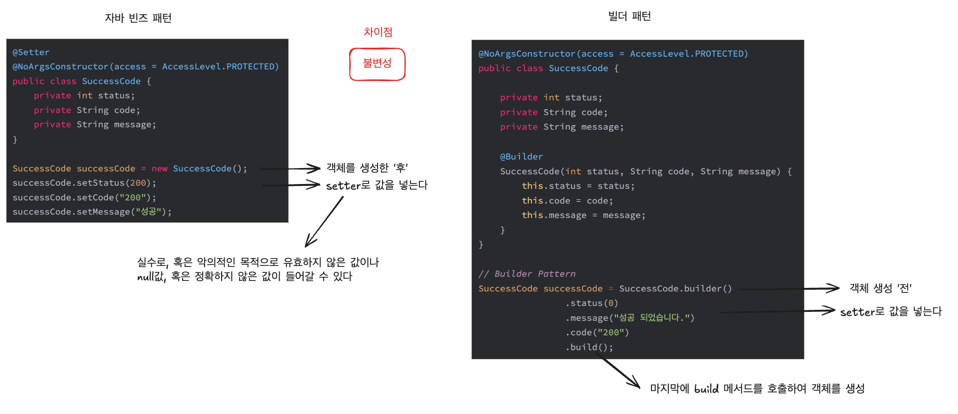

# 생성자와 정적 팩터리 메서드의 제약
- 생성자와 정적 팩터리 메서드에는 선택적 매개변수가 많을 때 적절히 대응하기 어렵다는 단점이 있다.


# 1. 점층적 생성자 패턴 (telescoping constructor pattern)
- 정의
    - 필수 매개변수를 받는 생성자 1개를 시작으로, 선택 매개변수를 하나씩 늘려가는 방식으로 생성자를 설계

- 단점
1. 초기화하고 싶은 필드만 포함한 생성자가 없다면, 설정하길 원치 않는 필드까지 매개변수에 값을 지정해줘야 한다.
2. 가독성이 떨어지고 복잡해짐
3. 매개변수가 많아질수록 관리가 어려움

# 2. 자바빈즈 패턴 (JavaBeans pattern)
- 정의
    - 매개변수가 없는 기본 생성자로 객체 생성 후, setter 메서드로 원하는 값을 설정

- 단점
1. 객체 하나를 만들려면 메서드를 여러 개 호출해야 한다.
2. 객체가 완성되기 전까지는 일관성이 무너진 상태에 놓이게 된다. 
   - 불완전한 객체 상태로 남을 가능성
   - 클래스를 불변으로 만들 수 없으며 스레드 안전성을 얻으려면 추가 작업(freeze 등)을 해줘야 한다.

=> 빌더 패턴은 객체를 한 번에 만들도록 도와주고, 일관성과 불변성을 더 쉽게 유지할 수 있게 한다.

# 3. 빌더 패턴
- Builder를 이용해 필수 매개변수로 객체를 생성하고, 일종의 setter를 사용하여 선택 매개변수를 초기화한 뒤
  build() 메서드를 호출하여 완전한 객체를 생성하는 패턴
- 점층적 생성자 패턴의 안전성과 자바빈즈 패턴의 가독성을 겸비했다.
  - 클라이언트는 필요한 객체를 직접 만드는 대신, 필수 매개변수 만으로 생성자(혹은 정적 팩터리)를 호출해 빌더 객체를 얻는다.
  - 그런 다음 빌더 객체가 제공하는 일종의 세터 메스드들로 원하는 선택 매개변수들을 설정한다.
    마지막으로 매개변수가 없는 build메서드를 호출해 (보통은 불변적인) 객체를 얻는다.

- 단점
1. 성능
   - 객체를 만들려면 그에 앞서 빌더부터 만들어야 한다. 물론 빌더 생성 비용이 크진 않지만, 성능에 민감한 상황에서는 문제가 될 수 있다.
2. 장황 
   - 점층적 생성자 패턴보다는 코드가 장황해 매개변수가 4개 이상은 되어야 값어치를 한다.

Builder 패턴 vs Java beans 패턴 
- 빌더 패턴은 객체 사용 중에 값이 변경될 우려가 없으며, 불변성과 안정성이 올라간다
  - 빌더 패턴 사용시에는 public setter 메서드를 선언해서는 안된다.




## 계층적으로 설계된 클래스와 Builder
- Builder 패턴은 복잡한 객체를 단계적으로 생성할 수 있도록 도와준다.
- 상위 클래스의 빌더를 상속받아 하위 클래스에서 재사용 가능
- 유용: 생성자의 매개변수가 많거나, 계층적 클래스를 정의해야할 때

### 계층적으로 설계된 클래스란?
- 정의: 부모 클래스(상위 클래스)와 이를 확장하는 자식 클래스(하위 클래스)로 계층 구조를 구성하는 설계 방식입니다.
- 부모 클래스에 공통 기능을 정의하고, 자식 클래스에서 확장하거나 커스터마이징

# 4. Lombok @Builder
- 정의
    - Lombok의 @Builder 애노테이션으로 간편하게 Builder 패턴 구현

- 장점
  - setter 없이 필요한 값을 set한 후에 build하여 thread-safe하게 사용 가능
  - 불필요한 코드를 줄여 생산성 향상


# 결론
1. 선택 기준
- 생성자나 정적 팩터리에서 처리해야 할 매개변수가 많다면 Builder 패턴이 적합
- 특히 매개변수 중 다수가 선택 사항이거나 같은 타입일 때 유용

2. 안전성과 가독성
- 빌더는 점층적 생성자보다 가독성이 좋고, 자바빈즈보다 안전함

# 개인적인 생각
- 매개변수가 적다면 생성자가 나을 수도 있다. 생성자를 통해 제약을 만들 수 있기 때문
- 필수적 매개변수와 선택적 매개변수 구분 중요


### 계층적 클래스와 Builder 패턴 코드 예시
1. 코드 재사용: 부모 클래스인 Car의 공통 속성과 Builder를 상속받아 중복 제거
2. 확장성: 새로운 하위 클래스를 추가할 때 기존 코드를 거의 수정하지 않아도 됨
3. Builder 패턴의 유연성: 각 클래스의 고유한 속성(topSpeed, payloadCapacity)을 추가하면서도 유연한 객체 생성을 유지
4. 가독성: 메서드 체이닝을 활용하여 복잡한 객체를 직관적으로 생성 가능


상위클래스
```java
// 상위 클래스: Car
abstract class Car {
    protected String make;    // 제조사
    protected String model;   // 모델명
    protected String color;   // 색상
    protected int year;       // 연식

    protected Car(Builder<?> builder) {
        this.make = builder.make;
        this.model = builder.model;
        this.color = builder.color;
        this.year = builder.year;
    }

    @Override
    public String toString() {
        return "Car{" +
            "make='" + make + '\'' +
            ", model='" + model + '\'' +
            ", color='" + color + '\'' +
            ", year=" + year +
            '}';
    }

    // Builder 패턴 기본 클래스
    public static abstract class Builder<T extends Builder<T>> {
        private final String make;  // 필수 속성
        private final String model; // 필수 속성
        private String color;
        private int year;

        protected Builder(String make, String model) {
            this.make = make;
            this.model = model;
        }

        public T color(String color) {
            this.color = color;
            return self();
        }

        public T year(int year) {
            this.year = year;
            return self();
        }

        protected abstract T self();

        public abstract Car build();
    }
}

```

하위클래스
```java
// 하위 클래스: SportsCar
class SportsCar extends Car {
    private final int topSpeed; // 최고 속도

    private SportsCar(Builder builder) {
        super(builder);
        this.topSpeed = builder.topSpeed;
    }

    @Override
    public String toString() {
        return super.toString() + ", SportsCar{" +
               "topSpeed=" + topSpeed +
               '}';
    }

    // Builder 클래스
    public static class Builder extends Car.Builder<Builder> {
        private int topSpeed; // 선택 속성

        public Builder(String make, String model) {
            super(make, model);
        }

        public Builder topSpeed(int topSpeed) {
            this.topSpeed = topSpeed;
            return this;
        }

        // 자식 클래스 타입을 반환하기위함
        @Override
        protected Builder self() {
            return this;
        }
        
        /** self()가 없다면
        public T color(String color) {
            this.color = color;
            return (T) this; // 직접 자식 클래스 타입을 반환
        }
        */  

        @Override
        public SportsCar build() {
            return new SportsCar(this);
        }
    }
}

// 하위 클래스: Truck
class Truck extends Car {
    private final int payloadCapacity; // 적재 용량

    private Truck(Builder builder) {
        super(builder);
        this.payloadCapacity = builder.payloadCapacity;
    }

    @Override
    public String toString() {
        return super.toString() + ", Truck{" +
               "payloadCapacity=" + payloadCapacity +
               '}';
    }

    // Builder 클래스
    public static class Builder extends Car.Builder<Builder> {
        private int payloadCapacity; // 선택 속성

        public Builder(String make, String model) {
            super(make, model);
        }

        public Builder payloadCapacity(int payloadCapacity) {
            this.payloadCapacity = payloadCapacity;
            return this;
        }

        @Override
        protected Builder self() {
            return this;
        }

        @Override
        public Truck build() {
            return new Truck(this);
        }
    }
}

```

사용 예시
```java
public class Main {
    public static void main(String[] args) {
        // SportsCar 생성
        SportsCar sportsCar = new SportsCar.Builder("Ferrari", "488")
                .color("Red")
                .year(2023)
                .topSpeed(330)
                .build();

        // Truck 생성
        Truck truck = new Truck.Builder("Ford", "F-150")
                .color("Blue")
                .year(2022)
                .payloadCapacity(1000)
                .build();

        System.out.println(sportsCar);
        System.out.println(truck);
    }
}

// 출력 결과
// Car{make='Ferrari', model='488', color='Red', year=2023}, SportsCar{topSpeed=330}
// Car{make='Ford', model='F-150', color='Blue', year=2022}, Truck{payloadCapacity=1000}
```


